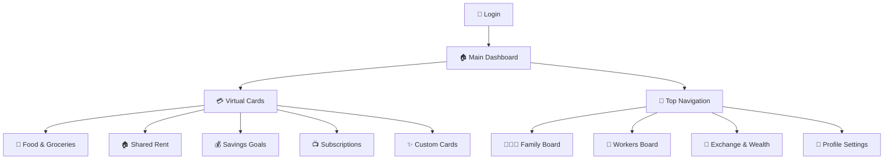
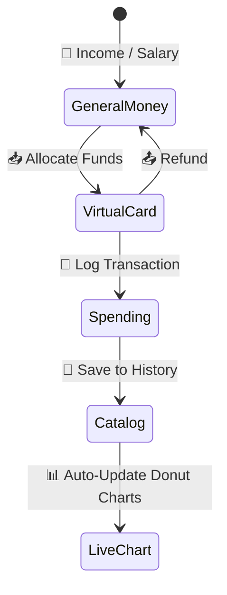
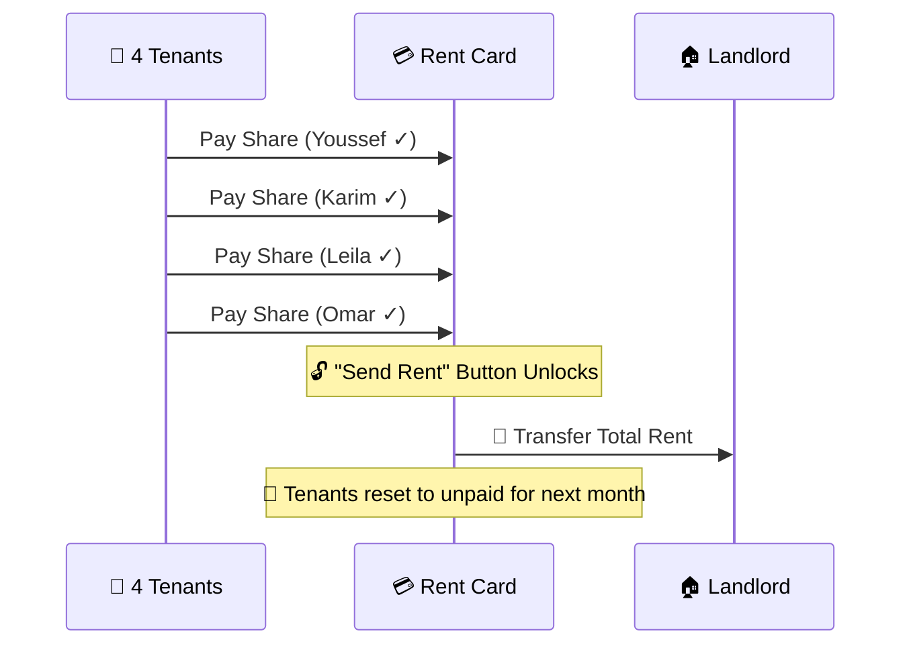

<div align="center">

<h1>🚀 CIH Smart Pockets</h1>

**Visual Envelope Budgeting • Shared Rent Management • Multi-Currency Wealth**

[](#)
[](#)
[](#)
[](#)

</div>

<br/>

## 🎯 4 Core Pillars

| 💳 **1. Purpose Cards** | 🏠 **2. Rent Manager** | 💱 **3. Global Wealth** | 👨‍👩‍👧 **4. Payroll system** |
| :--- | :--- | :--- | :--- |
| • Digital envelopes<br>• Custom icons & colors<br>• Isolated tracking<br>• Category analytics | • Track 4 tenants<br>• Auto-unlock rent payment<br>• Compare owner costs<br>• Track savings | • Live API rates<br>• Total MAD converter<br>• Crypto & Metals<br>• 7-day trend charts | • Family allowances<br>• Worker salaries<br>• Payment history<br>• Expense distributions |

<br/>

## 🗺️ App Architecture



<br/>

## 💸 Money Engine Flow



<br/>

## 🏠 Shared Rent Logic



<br/>

## ⚡ Quick Start

```bash
# 1. Install dependencies
npm install

# 2. Start local server
npm run dev
```

| 👤 User | 🔑 Password |
| :--- | :--- |
| `admin` | `admin123` |
| `mohamed` | `1234` |
