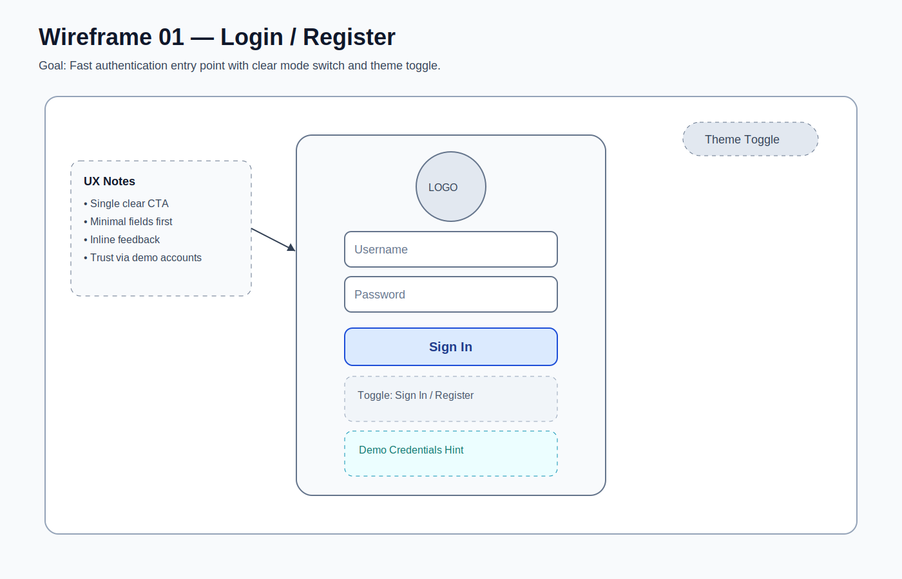
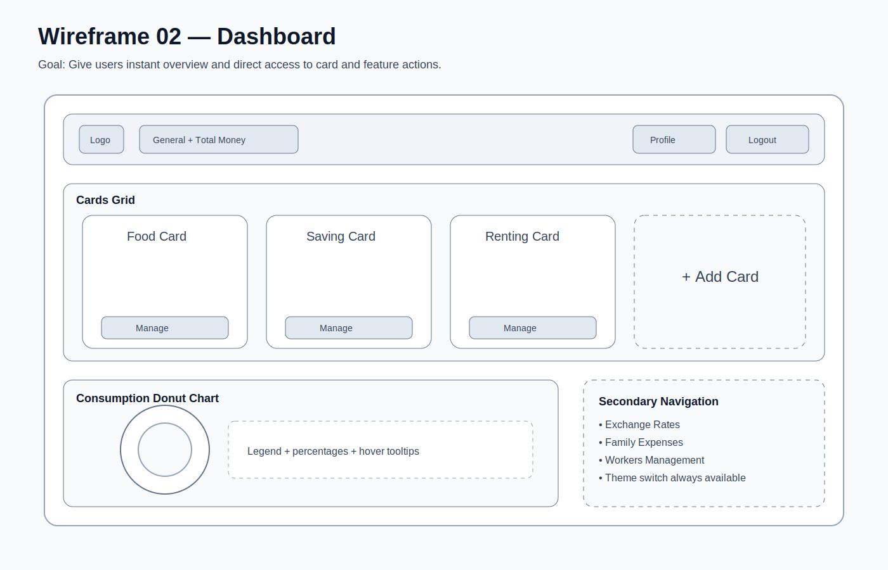
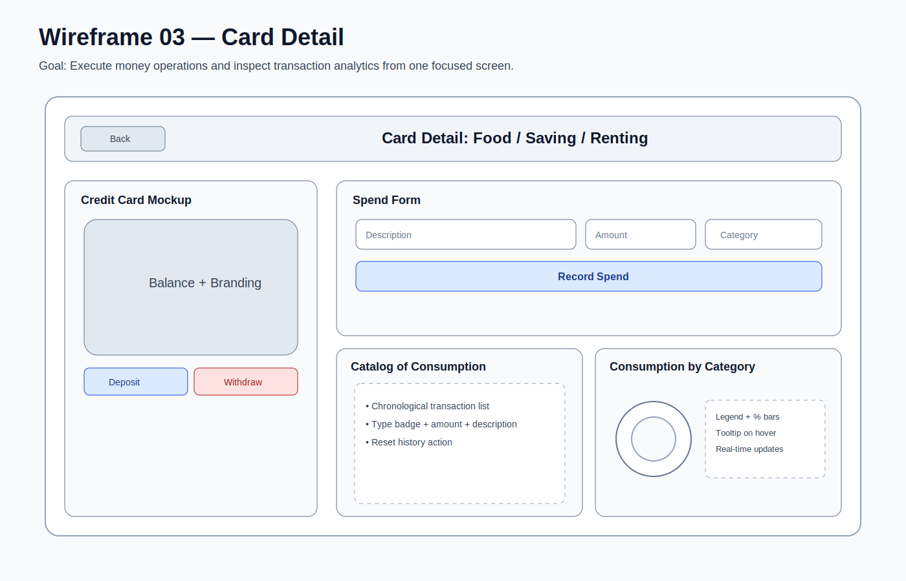
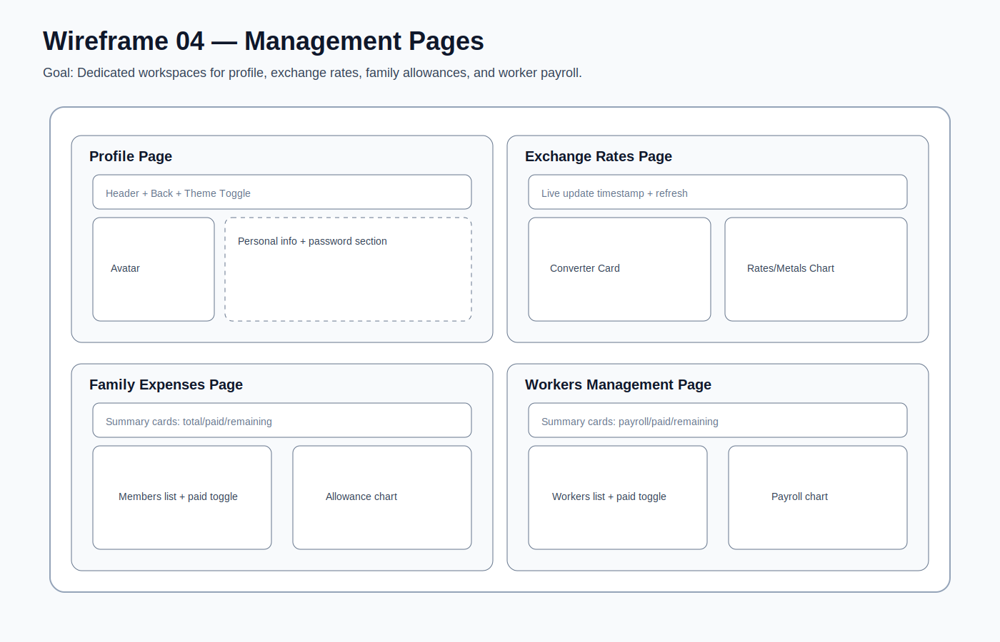
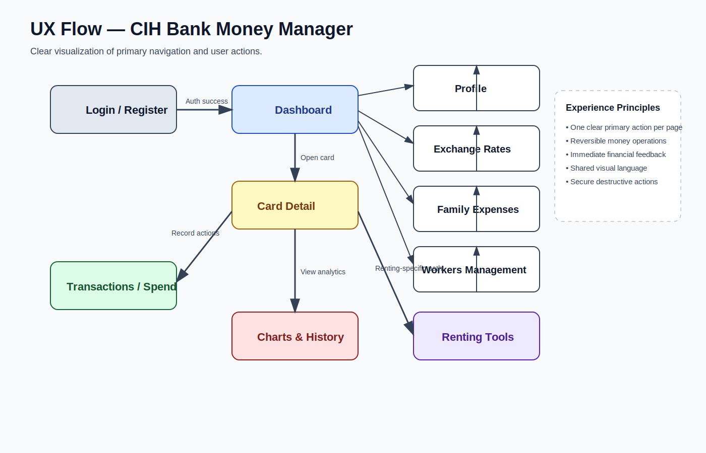

# Wireframes & UX Visualization

This folder contains low-fidelity mockups and a user-flow map that clearly visualize the user experience of the CIH Bank money manager app.

## Included Artifacts

1. **Login / Register**  
   `01-login-wireframe.svg`  
   Focus: authentication entry, form clarity, theme toggle.

2. **Dashboard**  
   `02-dashboard-wireframe.svg`  
   Focus: high-level financial overview, card actions, chart visibility.

3. **Card Detail**  
   `03-card-detail-wireframe.svg`  
   Focus: spend operations, transaction history, analytics blocks.

4. **Management Pages**  
   `04-management-pages-wireframe.svg`  
   Focus: Profile, Exchange Rates, Family Expenses, Workers Management.

5. **User Flow Diagram**  
   `05-user-flow.svg`  
   Focus: end-to-end navigation and major interaction paths.

## Quick Preview

### 01 — Login / Register

### 02 — Dashboard

### 03 — Card Detail

### 04 — Management Pages

### 05 — UX Flow

